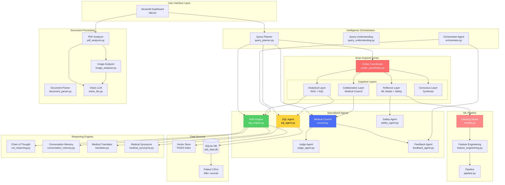
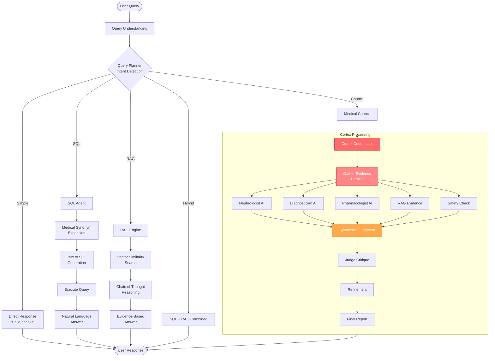
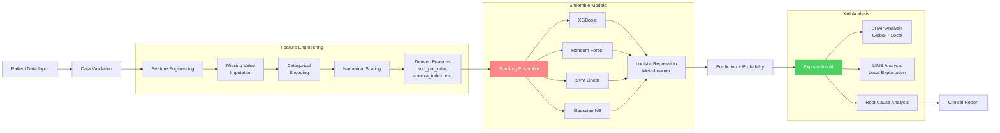
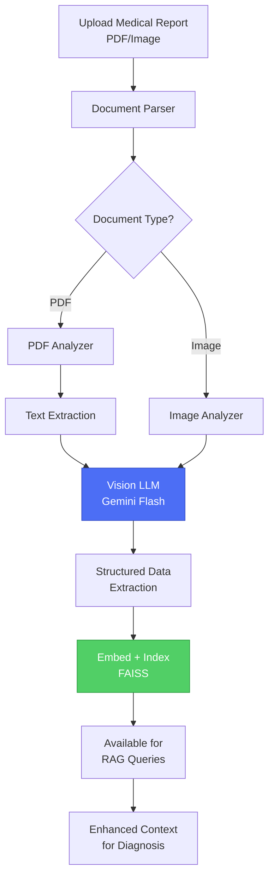

# KidneyPred AI: System Architecture Documentation 🏗️

## Table of Contents
- [Overview](#overview)
- [System Architecture](#system-architecture)
- [Process Flow](#process-flow)
- [Component Details](#component-details)
- [Data Flow](#data-flow)
- [Technology Stack](#technology-stack)

---

## Overview

KidneyPred AI is a brain-inspired, multi-agent diagnostic system for Chronic Kidney Disease (CKD) prediction and analysis. The system combines machine learning with intelligent query routing, RAG-based knowledge retrieval, and multi-specialist medical consultation to provide comprehensive clinical insights.

### Key Features
- 🧠 **Brain-Inspired Architecture**: Cortex Coordinator mimics human cognitive layers
- 🤖 **Multi-Agent Council**: 3 specialist AI doctors deliberate in parallel
- 📊 **Intelligent Query Routing**: Automatic tool selection based on query intent
- 🔍 **RAG Engine**: Medical knowledge retrieval from clinical reasoning dataset
- 💾 **SQL Analytics**: Natural language to SQL for patient data queries
- 📄 **Document Analysis**: PDF report parsing with vision LLM
- 🎯 **~91% Accuracy**: Stacking ensemble trained on 58k+ patients

---

## System Architecture



---

## Process Flow

### 1. Query Processing Flow



### 2. ML Prediction Flow



### 3. Document Analysis Flow



---

## Component Details

### Core Components

#### 1. Cortex Coordinator (`cortex_coordinator.py`)
**Purpose**: Brain-inspired cognitive orchestrator that mimics human diagnostic reasoning

**Cognitive Layers**:
- **Reflexive**: Fast pattern matching (ML model, safety flags)
- **Analytical**: Research and data analysis (RAG + SQL)
- **Collaborative**: Expert consultation (Medical Council)
- **Conscious**: Final synthesis and judgment

**Key Methods**:
- `gather_evidence()`: Parallel evidence collection from all layers
- `synthesize_judgment()`: Integrate evidence into clinical judgment
- `diagnose()`: Full cognitive pipeline with critique loop

#### 2. Query Planner (`query_planner.py`)
**Purpose**: Intelligent query router using pattern matching + LLM classification

**Query Types**:
- `simple`: Greetings, basic responses
- `sql`: Data queries (counts, statistics, aggregations)
- `rag`: Medical knowledge questions
- `council`: Diagnostic/treatment recommendations
- `hybrid`: Combined data + knowledge queries

**Routing Strategy**:
1. Fast pattern-based shortcuts (regex)
2. Fallback to LLM classification if ambiguous

#### 3. Medical Council (`council.py`)
**Purpose**: Multi-specialist deliberation system

**Specialists**:
1. **Dr. Nemotron** (Nephrologist): Renal physiology expert
2. **Dr. Mistral** (Diagnostician): Devil's advocate, differential diagnosis
3. **Dr. GLM** (Pharmacologist): Medication safety and lifestyle

**Process**:
- Parallel consultation (ThreadPoolExecutor)
- Independent opinions from each specialist
- Synthesis into consensus report
- Safety validation via `SafetyGuardrailAgent`

#### 4. RAG Engine (`rag_engine.py`)
**Purpose**: Medical knowledge retrieval with conversational memory

**Features**:
- FAISS vector index of clinical reasoning dataset
- Conversation history tracking
- Dual retrieval: Knowledge base + patient reports
- Chain-of-thought reasoning
- Multi-language support via translator

**Tech Stack**:
- Embeddings: `sentence-transformers/all-MiniLM-L6-v2`
- VectorStore: FAISS
- LLM: OpenRouter API

#### 5. SQL Agent (`sql_agent.py`)
**Purpose**: Natural language to SQL for patient data analytics

**Capabilities**:
- Text-to-SQL generation with medical context
- Query expansion via medical synonyms
- Result formatting with natural language
- Safety: SELECT-only queries

**Database Schema**:
- `ckd_patients`: UCI CKD dataset (400 patients)
- `esrd_records`: End-stage renal disease (7M+ records)
- `health_data`: General health indicators (700k+ records)

#### 6. Safety Agent (`safety_agent.py`)
**Purpose**: Clinical safety validation and disclaimer injection

**Checks**:
- Detect overconfident medical claims
- Flag missing disclaimers
- Identify dangerous recommendations
- Add regulatory compliance warnings

#### 7. Orchestrator Agent (`orchestrator.py`)
**Purpose**: Parallel task execution for complex analyses

**Workflow**:
1. **Plan**: Break down patient case into research tasks
2. **Execute**: Parallel RAG queries with feedback loop
3. **Synthesize**: Combine into comprehensive report

---

### Supporting Components

#### Feature Engineering (`feature_engineering.py`)
Creates domain-specific features:
- `sod_pot_ratio`: Electrolyte imbalance indicator
- `anemia_index`: Hemoglobin × RBC count
- `creatinine_gfr_interaction`: Kidney filtration efficiency
- `metabolic_risk`: Combined HTN + DM risk

#### Chain of Thought Reasoning (`cot_reasoning.py`)
Step-by-step clinical reasoning for complex queries

#### Medical Synonyms (`medical_synonyms.py`)
Query expansion for clinical terminology (e.g., "kidney" → renal, nephro)

#### Document Parser (`document_parser.py`)
Multi-format document ingestion (PDF, images, text)

#### Vision LLM (`vision_llm.py`)
Gemini Flash for OCR and medical report interpretation

#### Conversation Memory (`conversation_memory.py`)
Maintains chat context for multi-turn conversations

---

## Data Flow

### Input Data
1. **Patient Biometrics**: 40+ clinical features (age, BP, creatinine, GFR, etc.)
2. **Medical Reports**: Uploaded PDFs/images
3. **User Queries**: Natural language questions

### Data Processing Pipeline

```
Raw Data → Validation → Imputation → Encoding → Feature Engineering → ML Model → Prediction
                                                                                      ↓
                                                                          XAI (SHAP + LIME)
                                                                                      ↓
                                                                            Clinical Report
```

### Output Data
1. **Prediction**: CKD probability + confidence
2. **Explanations**: SHAP and LIME feature importance
3. **Recommendations**: Clinical actions, medications, lifestyle
4. **Evidence**: RAG citations, SQL query results

---

## Technology Stack

### Frontend
- **Framework**: Streamlit
- **UI Components**: Custom CSS styling, metrics cards, charts

### Backend
- **Language**: Python 3.10+
- **ML Framework**: scikit-learn, XGBoost
- **LLM Integration**: LangChain + OpenRouter
- **Vector DB**: FAISS
- **SQL DB**: SQLite
- **Document Processing**: PyPDF2, Pillow, Google Gemini

### Machine Learning
- **Ensemble**: Stacking Classifier
  - Base: XGBoost, Random Forest, SVM, Gaussian NB
  - Meta: Logistic Regression
- **XAI**: SHAP, LIME
- **Feature Engineering**: Custom medical features

### LLM Models (via OpenRouter)
- **Primary**: `nvidia/nemotron-3-nano-30b-a3b:free`
- **Vision**: `google/gemini-flash-1.5-8b`

### Data
- **Training**: 58,000+ patient records
- **Sources**: UCI CKD, Kaggle D3, Kaggle ESRD
- **Knowledge Base**: Clinical reasoning dataset (HuggingFace)

### Deployment
- **Container**: Docker
- **CI/CD**: GitHub Actions
- **Testing**: pytest, overfitting checks, reliability tests

---

## Project Statistics

| Metric | Value |
|--------|-------|
| **Python Modules** | 37 |
| **Training Samples** | 58,000+ |
| **Clinical Features** | 40+ |
| **Model Accuracy** | ~91% |
| **Test Coverage** | Unit + Integration |
| **Docker Ready** | ✅ |
| **CI/CD Pipeline** | ✅ |

---

## Key Design Decisions

### 1. Why Brain-Inspired Architecture?
Mimics human expert reasoning: reflexive pattern recognition → analytical research → collaborative consultation → conscious synthesis

### 2. Why Multi-Agent Council?
Reduces AI hallucination via diverse perspectives and cross-validation

### 3. Why Hybrid RAG + SQL?
Combines factual data (SQL) with medical knowledge (RAG) for comprehensive answers

### 4. Why Stacking Ensemble?
Leverages strengths of multiple algorithms to achieve ~91% accuracy

### 5. Why SHAP + LIME?
SHAP provides global feature importance, LIME provides patient-specific explanations

---

## Development Guidelines

### Adding New Agents
1. Create agent class with `__init__()` and main method
2. Integrate with Query Planner routing logic
3. Add pattern matching rules if applicable
4. Implement parallel execution if multi-step

### Modifying ML Pipeline
1. Update `feature_engineering.py` for new features
2. Retrain model via `train.py`
3. Run `overfitting_check.py` and `reliability_test.py`
4. Update XAI analysis in `app.py`

### Extending RAG
1. Add new documents to vector store via `rag_engine.build_index()`
2. Update retrieval prompts in `rag_engine.chat_reasoning()`
3. Test with edge cases

---

## Configuration

See [`config.yaml`](config.yaml) for system configuration:
- Model paths
- Monitoring thresholds
- Important features
- Logging settings

---

## Future Enhancements

- [ ] Multi-modal inputs (lab images, ultrasound)
- [ ] Real-time monitoring dashboard
- [ ] Integration with EHR systems
- [ ] Fine-tuned medical LLM
- [ ] Federated learning for privacy
- [ ] Mobile app deployment

---

**Created by**: Avirup Roy  
**License**: Research Use Only  
**Disclaimer**: Not for clinical use
