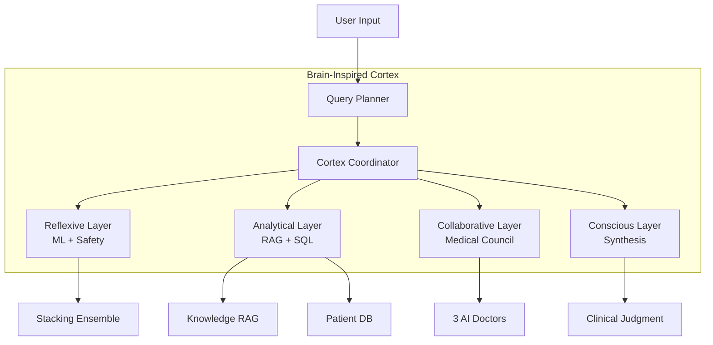

# KidneyPred AI: Advanced Diagnostic System 🩺

KidneyPred AI is a state-of-the-art machine learning solution designed to predict Chronic Kidney Disease (CKD) using clinical biometric data. This project delivers a production-grade diagnostic pipeline, combining high-accuracy ensemble modeling with multi-perspective Explainable AI (XAI) to ensure clinical transparency and trust.


## 📚 Documentation
- **[System Architecture](ARCHITECTURE.md)**: Comprehensive technical documentation with architecture diagrams, process flows, and component details
- **[Visual Walkthrough](WALKTHROUGH.md)**: Interactive dashboard guide and XAI features

---

## 🌟 Project Overview
The system leverages a massive dataset of **58,000+ patients** (D4 ESRD + UCI), incorporating **40+ clinical features**. It is designed to assist medical researchers and practitioners in identifying CKD risk factors and understanding the underlying drivers of specific predictions.

### Key Highlights:
| Feature | Description |
|---------|-------------|
| **~91% Accuracy** | Achieved through robust Stacking Ensemble with proper train/test validation |
| **Brain-Inspired Architecture** | CortexCoordinator orchestrates cognitive layers (Reflexive → Conscious) |
| **LLM Medical Council** | 3 specialist AI doctors deliberate in parallel (Nephrologist, Diagnostician, Pharmacologist) |
| **Gemini 2.0 Parsing** | Automated extraction of patient metadata from PDF reports |
| **Context-Aware Chat** | Both Deep Think and Fast modes now see uploaded PDFs and patient data |
| **Explainable AI (XAI)** | Integrated SHAP and LIME for Root Cause Analysis |
| **Production Ready** | Fully Dockerized with unit tests and CI/CD pipeline |

---

## 🧠 Architecture Overview



### Core Components:
- **🧠 Cortex Coordinator** (`cortex_coordinator.py`): Brain-inspired orchestrator with 4 cognitive layers
- **🤖 Medical Council** (`council.py`): Parallel specialist deliberation (Dr. Nemotron, Dr. Mistral, Dr. GLM)
- **🔍 RAG Engine** (`rag_engine.py`): Medical knowledge retrieval from clinical datasets
- **💾 SQL Agent** (`sql_agent.py`): Natural language to SQL for 58k+ patient records
- **🎯 Query Planner** (`query_planner.py`): Intelligent routing (simple/sql/rag/council/hybrid)
- **📄 PDF Analyzer** (`pdf_analyzer.py`): Gemini Flash 2.0 for structured report extraction
- **⚖️ Judge Agent** (`judge_agent.py`): Self-evaluation and quality scoring

**→ See [ARCHITECTURE.md](ARCHITECTURE.md) for detailed diagrams and component documentation**

---

## 🧬 Model Architecture
The core engine is a **Stacking Classifier** that combines:
1. **XGBoost**: Complex non-linear interactions
2. **Random Forest**: Robust tree-based classification
3. **SVM (Linear)**: Margin-based separation
4. **Logistic Regression**: Meta-Learner
5. **Gaussian Naive Bayes**: Probabilistic baseline

### Feature Engineering:
- `sod_pot_ratio`: Electrolyte imbalance indicator
- `anemia_index`: Hemoglobin × RBC count
- `creatinine_gfr_interaction`: Kidney filtration efficiency
- `metabolic_risk`: Combined HTN + DM risk

---

## 🧪 Explainable AI (XAI) Lab
Two lenses for interpretability:
- **🎯 SHAP**: Game theory-based feature attribution
- **🧪 LIME**: Local surrogate explanations


---

## 🛠️ Installation & Usage

### Local Setup
```bash
git clone https://github.com/AvirupRoy2195/Risk-Factor-Prediction-of-Chronic-Kidney-Disease.git
cd Risk-Factor-Prediction-of-Chronic-Kidney-Disease
pip install -r requirements.txt
streamlit run app.py
```

### Docker Deployment
```bash
docker build -t kidneypred-ai .
docker run -p 8501:8501 kidneypred-ai
```

### Environment Variables
Create a `.env` file:
```
OPENROUTER_API_KEY=your_openrouter_api_key
```

---

## 🧪 Testing & Validation
```bash
pytest test_pipeline.py -v
python verify_vif.py  # Multicollinearity check
```

### Validation Report
- **Learning Curves**: Training and Validation scores converge
- **Proper Validation**: SMOTE applied only to training data
- **Honest Metrics**: ~91% accuracy on held-out test data

> ⚠️ **Note**: Earlier versions reported higher accuracy (~95-100%) due to SMOTE leakage. Current metrics reflect true generalization.


---

## 📊 Project Statistics

| Metric | Value |
|--------|-------|
| **Python Modules** | 37+ |
| **Training Samples** | 58,000+ |
| **Clinical Features** | 40+ |
| **Model Accuracy** | ~91% |
| **LLM Agents** | 6 (Council, Judge, Safety, RAG, SQL, Cortex) |
| **Docker Ready** | ✅ |
| **CI/CD Pipeline** | ✅ |

---

## 📜 Disclaimer
This tool is for **research purposes only**. It is not intended for clinical use and should not substitute for professional medical judgment.

---

**Created by**: Avirup Roy  
**Powered by**: Advanced Agentic Coding
