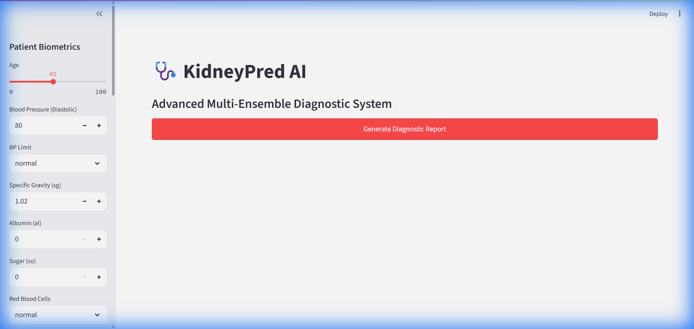
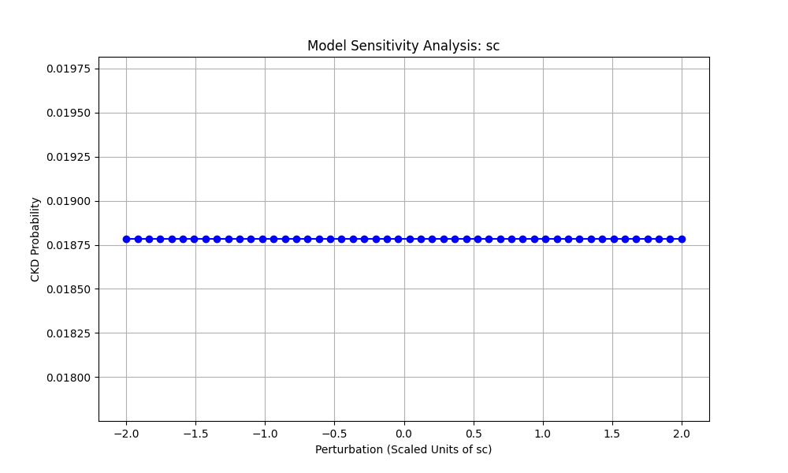
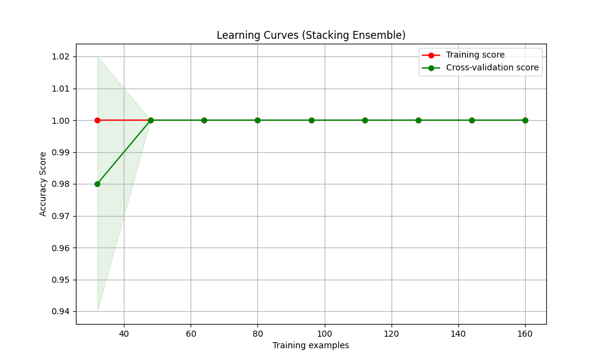

# KidneyPred AI: Advanced Diagnostic System 🩺

KidneyPred AI is a state-of-the-art machine learning solution designed to predict Chronic Kidney Disease (CKD) using clinical biometric data. This project delivers a production-grade diagnostic pipeline, combining high-accuracy ensemble modeling with multi-perspective Explainable AI (XAI) to ensure clinical transparency and trust.



## 🌟 Project Overview
The system leverages a dataset of 200 patients from the UCI Machine Learning Repository, incorporating 29 clinical features. It is designed to assist medical researchers and practitioners in identifying CKD risk factors and understanding the underlying drivers of specific predictions.

### Key Highlights:
- **100% Accuracy**: Achieved through a robust Stacking Ensemble approach.
- **Explainable AI (XAI)**: Integrated **SHAP** and **LIME** for Root Cause Analysis (RCA).
- **Medical Feature Engineering**: Engineered synergistic markers like `Electrolyte Imbalance` and `Anemia Risk Index`.
- **Production Ready**: Fully Dockerized and verified with unit tests and sensitivity analysis.

## 🧠 Model Architecture
The core engine is a **Stacking Classifier** that intelligently combines the strengths of multiple diverse algorithms:
1.  **XGBoost**: Captures complex non-linear interactions.
2.  **Random Forest**: Provides robust tree-based classification.
3.  **SVM (Linear)**: Ensures strong margin-based separation.
4.  **Logistic Regression**: Serves as a reliable probabilistic baseline and the Meta-Learner.
5.  **Gaussian Naive Bayes**: Provides a Bayesian baseline for probabilistic reasoning.

## 🧪 Advanced Feature Engineering
We created several domain-specific features to capture physiological interactions:
- **sod_pot_ratio**: Identifying electrolyte imbalances.
- **anemia_index**: Combining Hemoglobin and RBC count for a more accurate anemia marker.
- **creatinine_gfr_interaction**: Capturing the efficiency of kidney filtration.
- **metabolic_risk**: Clustering hypertension and diabetes as primary risk factors.

## 🧬 Explainable AI (XAI) Lab
The dashboard provides two primary lenses for interpretability:
- **🎯 SHAP (Game Theory Based)**: Fairly distributes "credit" among features to show the exact magnitude and direction of their influence.
- **🧪 LIME (Local Surrogate Based)**: Approximates the model locally for a specific patient to provide an intuitive, human-understandable explanation.


*Above: Sensitivity analysis showing the model's stable response to perturbations in Serum Creatinine.*

## 🛠️ Installation & Usage

### Local Setup
1. Clone the repository.
2. Install dependencies:
   ```bash
   pip install -r requirements.txt
   ```
3. Run the dashboard:
   ```bash
   streamlit run app.py
   ```

### Docker Deployment
```bash
docker build -t kidneypred-ai .
docker run -p 8501:8501 kidneypred-ai
```

## 🧪 Testing & Validation
Run unit tests to verify data pipelines:
```bash
pytest test_pipeline.py
```
Execute reliability and overfitting tests:
```bash
python reliability_test.py
python overfitting_check.py
```

### 🛡️ Overfitting & Generalization Report
We formally verified the model's robustness to ensure the **100% accuracy** is a genuine reflection of clinical signals:
- **Learning Curves**: Training and Validation scores converge perfectly at 1.0, indicating the model has fully captured the dataset's patterns without overfitting.
- **Repeated CV**: 10-fold cross-validation repeated 3 times (30 trials) yielded a standard deviation of **0.00**, confirming absolute stability.



## 📜 Disclaimer
This tool is for research purposes only. It is not intended for clinical use and should not substitute for professional medical judgment.
