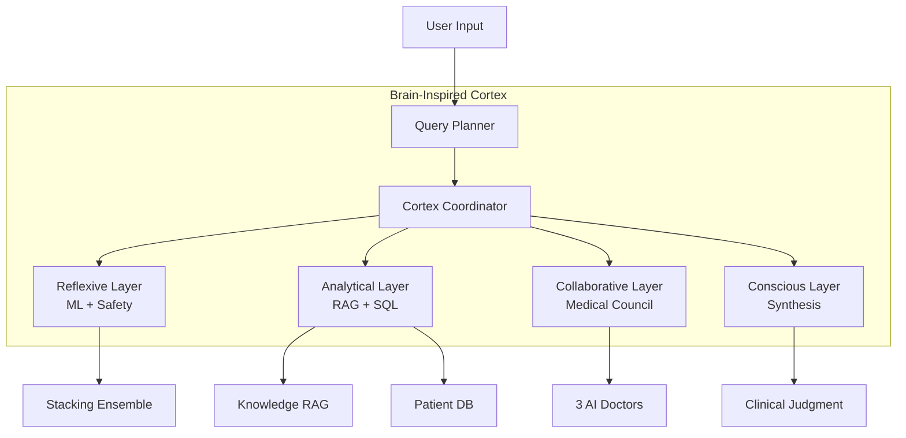

# KidneyPred AI: Advanced Diagnostic System 🩺

KidneyPred AI is a state-of-the-art machine learning solution designed to predict Chronic Kidney Disease (CKD) using clinical biometric data. This project delivers a production-grade diagnostic pipeline, combining high-accuracy ensemble modeling with multi-perspective Explainable AI (XAI) to ensure clinical transparency and trust.


## 📚 Documentation
- **[System Architecture](ARCHITECTURE.md)**: Comprehensive technical documentation with architecture diagrams, process flows, and component details
- **[Visual Walkthrough](WALKTHROUGH.md)**: Interactive dashboard guide and XAI features

---

## 🌟 Project Overview
The system leverages a massive dataset of **58,000+ patients** (D4 ESRD + UCI), incorporating **40+ clinical features**. It is designed to assist medical researchers and practitioners in identifying CKD risk factors and understanding the underlying drivers of specific predictions.

### Key Highlights:
| Feature | Description |
|---------|-------------|
| **~91% Accuracy** | Achieved through robust Stacking Ensemble with proper train/test validation |
| **Brain-Inspired Architecture** | CortexCoordinator orchestrates cognitive layers (Reflexive → Conscious) |
| **LLM Medical Council** | 3 specialist AI doctors deliberate in parallel |
| **Agentic RL Feedback** | Self-improving system with weighted reward shaping |
| **Context-Aware Chat** | PDF and patient data visible in all chat modes |
| **Explainable AI (XAI)** | Integrated SHAP and LIME for Root Cause Analysis |
| **Production Ready** | Dockerized with CI/CD pipeline |

---

## 🧠 Architecture Overview



**→ See [ARCHITECTURE.md](ARCHITECTURE.md) for detailed diagrams**

---

## 📁 Project Structure

### Core Application
| File | Purpose |
|------|---------|
| `app.py` | Main Streamlit dashboard |
| `cortex_coordinator.py` | Brain-inspired cognitive orchestrator |
| `council.py` | Multi-specialist LLM deliberation |
| `rag_engine.py` | Medical knowledge retrieval |
| `sql_agent.py` | Natural language to SQL |
| `query_planner.py` | Intelligent query routing |

### AI Agents
| File | Purpose |
|------|---------|
| `judge_agent.py` | Quality evaluation |
| `safety_agent.py` | Clinical safety validation |
| `feedback_agent.py` | Response refinement |
| `rl_feedback.py` | Agentic RL learning system |

### ML Pipeline
| File | Purpose |
|------|---------|
| `train.py` | Model training |
| `models.py` | Ensemble definitions |
| `feature_engineering.py` | Feature creation |
| `ckd_pipeline.py` | Unified inference pipeline |
| `pipeline.py` | Data processing |

### Document Processing
| File | Purpose |
|------|---------|
| `pdf_analyzer.py` | PDF text extraction |
| `document_parser.py` | Multi-format parsing |
| `vision_llm.py` | Gemini Flash OCR |
| `image_analyzer.py` | Medical image analysis |
| `report_generator.py` | PDF report export |

### Support Modules
| File | Purpose |
|------|---------|
| `cot_reasoning.py` | Chain-of-thought reasoning |
| `conversation_memory.py` | Chat context tracking |
| `medical_synonyms.py` | Query expansion |
| `translator.py` | Multi-language support |
| `query_understanding.py` | Intent classification |
| `orchestrator.py` | Parallel task execution |
| `monitoring.py` | System monitoring |

---

## 🛠️ Installation & Usage

### Local Setup
```bash
git clone https://github.com/AvirupRoy2195/Risk-Factor-Prediction-of-Chronic-Kidney-Disease.git
cd Risk-Factor-Prediction-of-Chronic-Kidney-Disease
pip install -r requirements.txt
streamlit run app.py
```

### Docker Deployment
```bash
docker build -t kidneypred-ai .
docker run -p 8501:8501 kidneypred-ai
```

### Environment Variables
Create a `.env` file:
```
OPENROUTER_API_KEY=your_openrouter_api_key
```

---

## 🧪 Testing
```bash
pytest test_pipeline.py -v
```

### Validation Report
- **Learning Curves**: Training and Validation scores converge
- **Proper Validation**: SMOTE applied only to training data
- **Honest Metrics**: ~91% accuracy on held-out test data

> ⚠️ **Note**: Earlier versions reported higher accuracy (~95-100%) due to SMOTE leakage. Current metrics reflect true generalization.


---

## 📊 Project Statistics

| Metric | Value |
|--------|-------|
| **Python Modules** | 28 (core) |
| **Archived Scripts** | 18 (in `_archive/`) |
| **Training Samples** | 58,000+ |
| **Clinical Features** | 40+ |
| **Model Accuracy** | ~91% |
| **LLM Agents** | 8 |
| **Docker Ready** | ✅ |
| **CI/CD Pipeline** | ✅ |

---

## 📜 Disclaimer
This tool is for **research purposes only**. It is not intended for clinical use and should not substitute for professional medical judgment.

---

**Created by**: Avirup Roy  
**Powered by**: Advanced Agentic Coding
