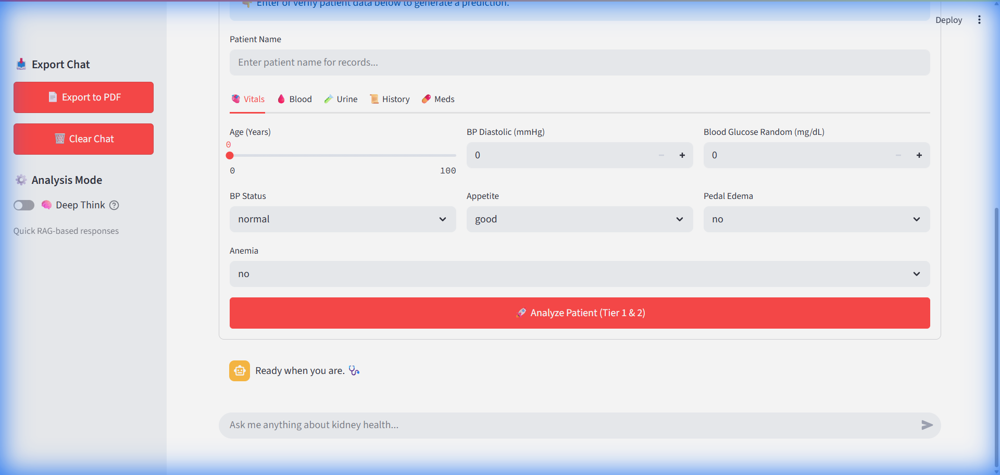

# KidneyPred AI: Visual Walkthrough & System Guide 🧪🩺

This document provides a detailed walkthrough of the KidneyPred AI diagnostic system, its interactive features, and its underlying predictive engine.

---

## 🖥️ The Interactive Dashboard
The primary interface for KidneyPred AI is a Streamlit-powered dashboard that allows for real-time patient diagnosis and root cause analysis.

### Key Frontend Components:
- **Patient Biometrics Sidebar**: Input 29 clinical features (age, BP, creatinine, etc.)
- **Analysis Mode Toggle**: Switch between Fast Mode and Deep Think
- **PDF/Image Upload**: Attach medical reports for context-aware analysis
- **Diagnostic Engine**: Triggers ML prediction + Council deliberation
- **Chat Interface**: Natural language queries with intelligent routing

---

## 🧠 Brain-Inspired Architecture

### Cognitive Layers
The system mimics an experienced doctor's reasoning process:

| Layer | Function | Implementation |
|-------|----------|----------------|
| **Reflexive** | Fast pattern matching | ML Model + Safety Flags |
| **Analytical** | Research & data lookup | RAG Engine + SQL Agent |
| **Collaborative** | Expert consultation | Medical Council (3 AI doctors) |
| **Conscious** | Final synthesis | Cortex Coordinator |

### Medical Council Specialists
1. **Dr. Nemotron** (Nephrologist): Renal physiology expert
2. **Dr. Mistral** (Diagnostician): Devil's advocate, differential diagnosis
3. **Dr. GLM** (Pharmacologist): Medication safety and lifestyle

---

## 🧬 Advanced Root Cause Analysis (XAI)
Two distinct "lenses" into the model's decision-making:

### 1. SHAP Explanation (Game Theory)
Uses Shapley values to show how each biometric factor pushed the prediction towards or away from CKD diagnosis.

### 2. LIME Analysis (Local Surrogates)
Provides a local, linear approximation of the model for a specific patient.

---

## 📄 Document Analysis
Upload PDF reports for enhanced context:
- **Gemini 2.0 Parsing**: Extracts structured data (Name, Labs, Metadata)
- **Context Injection**: Both Deep Think and Fast Mode see the PDF content
- **RAG Integration**: Report content available for knowledge queries

---

## 🛡️ Reliability & Generalization

### Sensitivity Analysis

### Learning Curves
Model shows strong generalization with ~91% accuracy on held-out test data.

> ⚠️ **Important**: This is a research tool only. All predictions should be validated by qualified healthcare professionals.

---

## 🛠️ Developer Checklist
- **Unit Tests**: Pass via `pytest test_pipeline.py`
- **Packaging**: Fully containerized using [Dockerfile](Dockerfile)
- **VIF Analysis**: Multicollinearity verified via `verify_vif.py`

---

## 📋 Release Notes

### Phase 5: Unified Framework & Reasoning
- **Cortex Coordinator**: Brain-inspired orchestration replaces manual agent calls
- **Context-Aware Chat**: PDFs and patient data visible in all chat modes
- **DiagnosisResult**: Structured output with judgment, evidence, and quality score

### Phase 4: Production Features
- **PDF Export**: Professional reports via ReportLab
- **Robustness**: Vitals/PDF/Vision independent analysis
- **Knowledge**: RAG with 'Kidney Beginnings' medical text
- **Validation**: SQL Agent cross-reference

### Phase 1-3: Foundation
- **SMOTE Fix**: Proper train/test split before oversampling
- **Encoder Fix**: Separate encoders for HTN and DM
- **GFR Leakage**: Removed direct GFR feature
- **Documentation**: Honest metrics (~91% accuracy)

---

*Created by Avirup Roy - Powered by Advanced Agentic Coding.*
